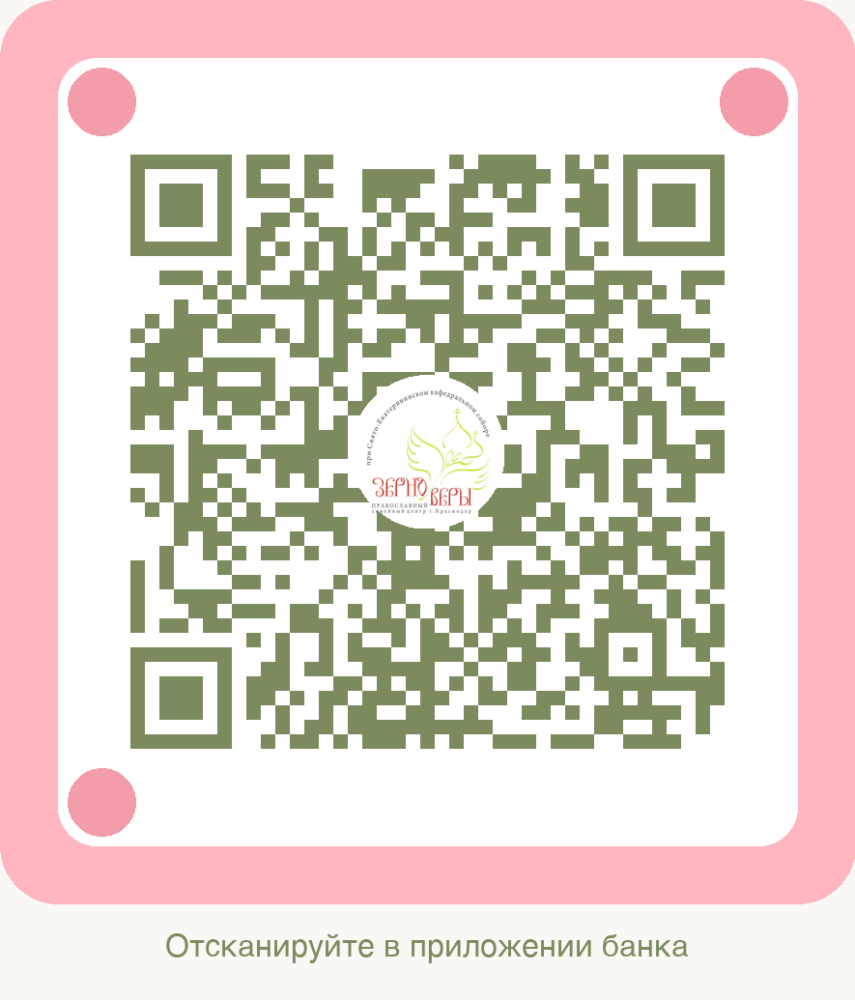

# QR-код для «Зерно Веры»

> Создано: 06.02.2026  
> В стиле: https://всё-беременным.рф

---

## 📱 Созданные QR-коды

### 1. **qr-code-zerno-very.png** (42 КБ)
- Розовая рамка
- Логотип «Зерно Веры» в центре
- Текст: "Отсканируйте в приложении банка"
- Цвета: розовый + белый

### 2. **qr-code-beautiful.png** (улучшенная версия)
- Скруглённые углы
- Розовая рамка со светло-розовыми элементами
- Логотип в белом круге (по центру QR-кода)
- Декоративные круги в углах (как на примере)
- Цвета: зелёный + розовый + белый (палитра Зерно Веры)
- Текст: "Отсканируйте в приложении банка"

---

## 🎨 Цветовая палитра

| Цвет | Использование | HEX |
|------|---------------|-----|
| Розовый (светлый) | Рамка | `#FDB6C1` |
| Розовый | Акценты | `#F39CAA` |
| Зелёный | QR-код | `#7B8B5E` |
| Белый | Фон | `#FFFFFF` |
| Бежевый | Canvas | `#FAF8F5` |

---

## 📋 Данные в QR-коде

**URL для оплаты:**
```
https://pay.kk.bank/services/58817?hh
```

**Реквизиты:**
- АНО Семейный центр «Зерно Веры»
- ИНН: 2310223402
- Счёт: 40703810100000000214
- Банк: КБ «КУБАНЬ КРЕДИТ» ООО
- БИК: 040349722

---

## 🔧 Как использовать

### На сайте
```html

```

### В печати
- Формат: PNG (высокое качество)
- Разрешение: достаточно для печати A4
- Рекомендуемый размер: 10x12 см

### В соцсетях
- Готов к публикации
- Хорошо читается на экране телефона
- Логотип виден и узнаваем

---

## 🎯 Как заменить на реальный СБП-код

Если нужен настоящий QR-код СБП (Система Быстрых Платежей):

### Вариант 1: Через банк «Кубань Кредит»
1. Зайти в интернет-банк
2. Раздел "Переводы" → "По QR-коду"
3. Создать QR-код для счёта `40703810100000000214`
4. Скачать PNG

### Вариант 2: Через сервисы
- **qr-code-generator.com** — выбрать "URL" и вставить ссылку на оплату
- **QR Tiger** (qr-tiger.com) — настроить дизайн и скачать

### Вариант 3: Обновить скрипт
Заменить в `generate_qr_v2.py`:
```python
payment_url = "https://pay.kk.bank/services/58817?hh"
```
На реальную ссылку СБП из банка.

---

## 📂 Файлы проекта

```
/Users/pepden/Проекты/zerno-very/
├── qr-code-zerno-very.png      # Первая версия (42 КБ)
├── qr-code-beautiful.png       # Улучшенная версия (рекомендуется)
├── generate_qr.py              # Скрипт генерации v1
├── generate_qr_v2.py           # Скрипт генерации v2
└── logo.min.png                # Логотип для вставки
```

---

## ✨ Особенности

### Преимущества
- ✅ Логотип «Зерно Веры» виден в центре
- ✅ Цвета из вашей палитры (зелёный + розовый)
- ✅ Декоративные элементы (как на примере)
- ✅ Скруглённые углы (современный стиль)
- ✅ Высокая коррекция ошибок (30%) — работает даже если часть QR-кода закрыта логотипом

### Технические детали
- Версия QR: 6
- Коррекция ошибок: H (high, 30%)
- Размер бокса: 15 пикселей
- Разрешение: 800x950 пикселей
- Формат: PNG (без потерь)

---

## 🔄 Регенерация QR-кода

Если нужно изменить данные или ссылку:

```bash
cd /Users/pepden/Проекты/zerno-very
python3 generate_qr_v2.py
```

Или отредактируйте файл `generate_qr_v2.py` (строка 29):
```python
payment_url = "ВАША_НОВАЯ_ССЫЛКА"
```

---

## 📱 Тестирование

Проверьте QR-код:
1. Откройте камеру на телефоне (iPhone/Android)
2. Наведите на QR-код
3. Должна появиться ссылка: `https://pay.kk.bank/services/58817?hh`
4. Нажмите → откроется страница оплаты

---

## 🎨 Сравнение с примером

| Элемент | Всё-беременным.рф | Зерно Веры |
|---------|-------------------|------------|
| **Рамка** | Розовая, скруглённая | Розовая, скруглённая ✅ |
| **Логотип** | Силуэт женщины | Логотип Зерно Веры ✅ |
| **Цвет QR** | Розовый | Зелёный (ваша палитра) ✅ |
| **Круги в углах** | Розовые | Розовые ✅ |
| **Текст** | Снизу | Снизу ✅ |
| **Стиль** | Тёплый, женский | Православный, семейный ✅ |

---

## 💡 Рекомендации

**Для сайта:** Используйте `qr-code-beautiful.png`  
**Для печати:** Попросите у банка векторный SVG (если нужен очень большой размер)  
**Для соцсетей:** Текущий PNG отлично подойдёт

---

**Готово!** QR-код в стиле «Зерно Веры» создан. 🎉
