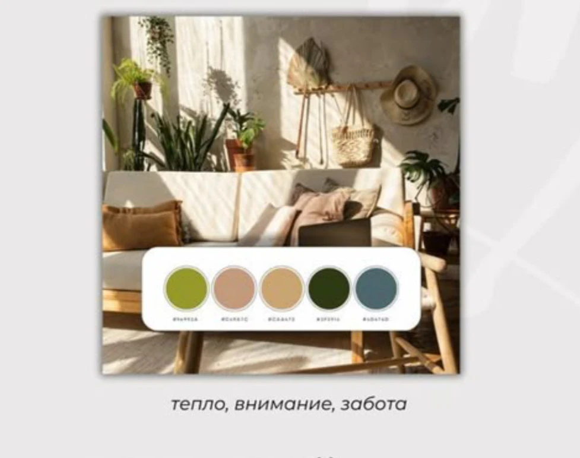

# Проект: Зерно веры

> АНО «Семейный центр «Зерно Веры» — православный семейный центр при Свято-Екатерининском кафедральном соборе

---

## Основная информация

| Параметр | Значение |
|----------|----------|
| **Название** | АНО «Семейный центр «Зерно Веры» |
| **Тип** | Православный семейный центр |
| **При храме** | Свято-Екатерининский кафедральный собор |
| **Благословение** | Митрополит Екатеринодарский и Кубанский Василий |
| **Руководитель** | Матушка Светлана Кравченко |
| **Духовник** | Иерей Андрей Кравченко (настоятель Благовещенского храма) |
| **Работает с** | 2007 года (18+ лет) |
| **Город** | Краснодар |
| **Адрес** | ул. Коммунаров, 52 (административное здание Собора, 3 этаж) |
| **Телефон** | 8-98-98-200-400 |
| **Сайт** | zernovery.ru |
| **Страница собора** | kubansobor.ru/famcenter/ |
| **VK** | vk.com/zerno_very |
| **Instagram** | @zernovery |
| **Дата создания проекта** | 2026-01-30 |

---

## Юридические реквизиты

| Параметр | Значение |
|----------|----------|
| **Полное название** | Автономная некоммерческая организация по поддержке семьи, супружества, отцовства, материнства и детства «Семейный центр «Зерно Веры» |
| **Краткое название** | АНО «Семейный центр «Зерно Веры» |
| **ИНН** | 2310223402 |
| **КПП** | 231001001 |
| **ОГРН** | 1212300013419 |
| **ОКПО** | 47554740 |
| **Расчётный счёт** | 40703810100000000214 |
| **Банк** | КБ «КУБАНЬ КРЕДИТ» ООО |
| **БИК** | 040349722 |
| **Корреспондентский счёт** | 30101810200000000722 |
| **Юридический адрес** | 350000, Краснодарский Край, г.о. Город Краснодар, г Краснодар, ул Коммунаров, дом 52 |
| **Телефон** | +79184316617 |
| **Руководитель** | Кравченко Светлана Михайловна |

---

## Миссия

> **Помочь прорасти зёрнышку веры в сердце каждого ребёнка и взрослого, чтобы оно проросло и приумножилось, став хлебом, питающим семью православную!**

**Слоган:** Для вас важны СЕМЬЯ, ДЕТИ, ЛЮБОВЬ И ВЗАИМОПОНИМАНИЕ?

---

## УТП (ключевое отличие)

> **Современной семье нужна не просто «развивашка» для детей, а надежная среда, где растут все вместе — и дети, и родители.**

---

## Целевая аудитория

**Основная:** женщины, мамы, бабушки (Краснодар)

**Расширенная:** семьи с детьми от 0 до 16 лет, которым важно:
- Духовно-нравственное воспитание
- Крепкие семейные ценности
- Православная среда
- Поддержка и единомышленники

---

## Программы для семей и детей

### Для будущих и молодых родителей

| Программа | Описание |
|-----------|----------|
| **«В ожидании чуда»** | Программа для семей с проблемами зачатия |
| **«Божий дар»** | Курс подготовки к родам и родительству |
| **«Мамушки-лялюшки»** | Клуб мам с детьми от 0 до 2 лет |

### Для малышей (совместно с родителями)

| Программа | Возраст | Описание |
|-----------|---------|----------|
| **«Дитятко»** | 1–2 года | Совместные занятия родителей и детей |
| **«Ладушки»** | 2–3 года | Совместные занятия родителей и детей |
| **«Крошки»** | 1,5–4 года | Растём в сотворчестве и сказке |

### Для дошкольников

| Программа | Возраст | Описание |
|-----------|---------|----------|
| **«Божий мир для дошкольников»** | 3–7 лет | Духовно-нравственное развитие |
| **«Подготовка к школе»** | 4–7 лет | Интеллектуальная и духовная подготовка |
| **«Добрые ступеньки к школе по РКШ»** | 4–6 лет | Русская классическая школа |
| **«Осьминотки»** | 4+ | Речь, музыкальный слух, координация |
| **«Песочная страна»** | 2–12 лет | Эмоциональный интеллект через игру |

### Для школьников

| Программа | Возраст | Описание |
|-----------|---------|----------|
| **«Божий мир для школьников»** | 8–16 лет | Духовно-нравственное развитие |
| **«Воинство Христово»** | — | Военно-патриотическое воспитание (мальчики) |
| **«Девичья краса»** | — | Воспитание женственности (девочки) |
| **Семейная школа** | 7–16 лет (1–9 кл.) | Для детей на семейном образовании |

---

## Творческие студии

| Студия | Направление |
|--------|-------------|
| **Художественная студия** | Рисование |
| **Изо-студия** | Изобразительное искусство |
| **Основы иконописи** | Церковное искусство |
| **Театральная студия** | Актёрское мастерство |
| **Вокальная студия** | Пение |
| **Хореография** | Танцы |
| **Каллиграфия** | Красивое письмо |
| **Лепка** | Скульптура |
| **Бисероплетение** | Рукоделие |
| **Изготовление народной игрушки** | Народные промыслы |
| **Студия мягкой игрушки** | Шитьё |
| **Хозяюшка** | Домоводство (для девочек) |
| **Умелый мастер** | Мастерство (для мальчиков) |
| **Русский рукопашный бой** | Единоборства |

---

## Для родителей

### Индивидуальные консультации

| Специалист | Направление |
|------------|-------------|
| **Детский психолог** | Развитие и поведение детей |
| **Педагог-психолог** | Обучение и адаптация |
| **Семейный консультант** | Отношения в семье, брак |
| **Массажист** | Здоровье |

### Клуб православных родителей

Беседы о:
- Семье и браке
- Воспитании детей
- Духовном росте
- Личностном развитии

### Совместные проекты

- Музыкальные спектакли
- Праздники (участвуют дети и родители вместе)

### Концертная деятельность

- **Площадка:** Концертный зал на Красной, 5 (1500 мест) — главный зал Краснодарского края
- **Формат:** Полноценные полуторачасовые спектакли
- **Особенности:** Хороводы в фойе, встреча гостей в костюмах, пряники и калачи
- **Праздники:** Рождество, Масленица, Пасха

---

## Почему выбирают «Зерно веры»

- Дети учатся главному — **любить, трудиться и отвечать за свои поступки**
- Родители находят **поддержку и единомышленников**
- Семья становится крепче через **общие традиции и ценности**
- **18+ лет опыта** работы с семьями
- **Благословение митрополита** — официальный статус при соборе

---

## Визуальный стиль (из ТЗ на лендинг)

**Концепция:** «Тепло, внимание, забота»

### Цветовая палитра

| Цвет | Описание | HEX |
|------|----------|-----|
| **Светлый бежевый** | Кремовый, песочный (фон) | #E8DCC8 |
| **Оливковый** | Приглушённый зелёный (росток) | #7D8B5E |
| **Тёмно-зелёный** | Глубокий изумрудный (акцент) | #2D4A3E |
| **Охра** | Горчичный, золотисто-коричневый (зерно) | #C9A227 |
| **Тёплый бежевый** | Песочный (дополнительный) | #D4C4A8 |
| **Красный** | Акцент для кнопок CTA | #B22222 |

### Стилистика

| Элемент | Описание |
|---------|----------|
| **Стиль** | Акварель, мягкие линии, плавные формы |
| **Образы** | Зерно, колосок, росток, семья, храм |
| **Узоры** | Растительные завитки, стилизованная хохлома (современная, не лубочная) |
| **Ключевой образ** | Детские руки с зёрнышками, обнимающие руки взрослого |

---

## Ключевые факты для рекламы

| Факт | Значение |
|------|----------|
| Опыт работы | 18+ лет (с 2007 г.) |
| Возраст детей | 0–16 лет |
| Количество программ | 10+ образовательных |
| Количество студий | 14 творческих |
| Специалисты | 4 направления консультаций |
| Статус | При кафедральном соборе |
| Уникальность | Растут вместе дети И родители |
| Формат | Бесплатные + платные программы |

---

## Документы проекта

| Документ | Описание |
|----------|----------|
| [project.md](project.md) | Карточка проекта (этот файл) |
| [tz-transcript.md](tz-transcript.md) | Полный транскрипт ТЗ на лендинг (21 мин аудио) |
| [landing-plan.md](landing-plan.md) | Детальный план лендинга (10 секций, дизайн-система) |
| [materials-request.md](materials-request.md) | Запрос материалов для Елены |
| [РЕКВИЗИТЫ АНО Семейный центр ЗЕРНО ВЕРЫ.docx](РЕКВИЗИТЫ%20АНО%20Семейный%20центр%20ЗЕРНО%20ВЕРЫ.docx) | Юридические реквизиты организации |
| [Договор_пожертвования_на_Зерно_Веры.docx](Договор_пожертвования_на_Зерно_Веры.docx) | Шаблон договора пожертвования для юр. лиц |
| [photos/](photos/) | Полученные фотографии (8 шт.) |
| [testimonials.md](testimonials.md) | Отзывы родителей (4 шт.) |
| [logo-guide.md](logo-guide.md) | Логотипы центра (3 версии: русская, английская, иконка) |
| **[План создания лендинга — Зерно веры.pdf](План%20создания%20лендинга%20—%20Зерно%20веры.pdf)** | PDF для клиента (батюшки, Елены) |

---

## Материалы проекта

### Полученная информация
- [x] Описание центра и программ (30.01.2026)
- [x] Буклеты центра — 2 шт. (30.01.2026)
- [x] Аудио ТЗ на лендинг — 21 мин (30.01.2026)
- [x] Транскрипт ТЗ (30.01.2026)

### Получено от клиента (04.02.2026)
- [x] 8 фотографий → [photos/](photos/)
  - [x] Портрет основателей (о. Андрей и м. Светлана)
  - [x] 7 фото для карусели (занятия, праздники, выступления)
- [x] Договор пожертвования → [Договор_пожертвования_на_Зерно_Веры.docx](Договор_пожертвования_на_Зерно_Веры.docx)
- [x] Реквизиты АНО → [РЕКВИЗИТЫ АНО Семейный центр ЗЕРНО ВЕРЫ.docx](РЕКВИЗИТЫ%20АНО%20Семейный%20центр%20ЗЕРНО%20ВЕРЫ.docx)
- [x] 4 отзыва родителей → [testimonials.md](testimonials.md)
- [x] Логотипы (3 версии) → [logo-guide.md](logo-guide.md)

### Ещё нужно от клиента
- [ ] Ещё 3 фото для карусели (10/10)
- [ ] Фото концертов из зала на Красной, 5

---

## План работ

### Лендинг
- [x] Транскрибация ТЗ
- [x] Анализ и структурирование информации
- [x] Определение целей лендинга
- [x] Структура страницы (10 блоков)
- [x] Контент-план
- [ ] Получить материалы от клиента
- [ ] Написать тексты для всех блоков
- [ ] Выбрать платёжную систему (ЮMoney / эквайринг)
- [ ] Прототип в Figma
- [ ] Согласование дизайна
- [ ] Вёрстка
- [ ] Подключение форм и платежей
- [ ] Тестирование и запуск

---

## История изменений

| Дата | Действие |
|------|----------|
| 2026-01-30 | Создан проект |
| 2026-01-30 | Добавлено описание центра, программы, ЦА, УТП |
| 2026-01-30 | Добавлены данные из буклетов: полный список программ (10+), творческие студии (14), консультации специалистов, контакты, соцсети |
| 2026-01-30 | Транскрибация аудио ТЗ (21 мин) → [tz-transcript.md](tz-transcript.md) |
| 2026-01-30 | Создан детальный план лендинга → [landing-plan.md](landing-plan.md) |
| 2026-01-30 | Добавлена цветовая палитра → [color-palette.png](color-palette.png) |
